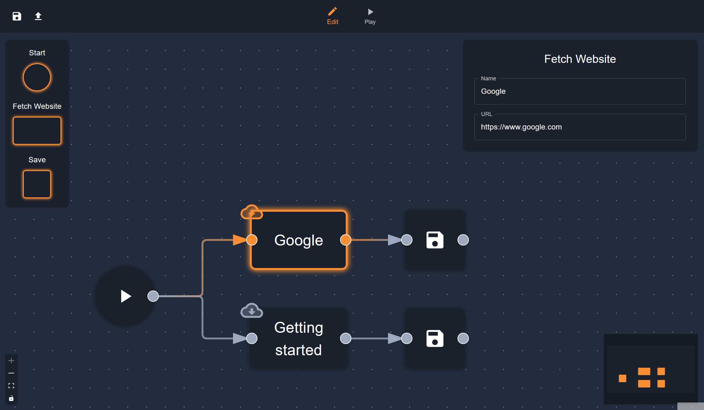
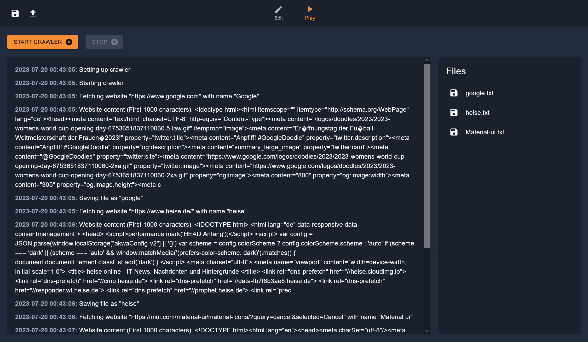

# Project Name

[](https://nextjs.org/)
[](https://reactflow.dev/)

## Overview

Node-Crawler is a highly customizable, Node-based web application for creating web crawlers and further processing and transforming the retrieved data. Users can build tailor-made web crawlers and manipulate and transform the collected data as needed. The output data format can be set to a wide range of formats including JSON, CSV, and various database formats.

The front end is developed using [Next.js](https://nextjs.org/), and the editor is based on the [React Flow](https://reactflow.dev/) library, which provides an intuitive and user-friendly interface for creating and editing web crawlers.




## Features

- **Node-based Editing**: Users can create and edit their own crawler workflows by drag-and-dropping nodes.
- **Data Transformation**: The application supports a variety of data manipulation and transformation operations for cleaning and restructuring the gathered data.
- **Data Export**: The transformed data can be output in a variety of formats including JSON, CSV, and various database formats.

## Installation

Make sure you have [Node.js](https://nodejs.org/en) and npm installed on your system before you start.

1. Clone the repository:

```shell
git clone https://github.com/MertenD/node-crawler.git
```

2. Navigate into the directory and install the dependencies:

```shell
cd node-crawler
npm install
```

3. Start the development server:

```shell
npm run dev
```

Now you should be able to see the web application on `http://localhost:3000` in your browser.

## Creating a New Node

Follow these steps when you need to create a new Node:

### Step 1: Add the Node to the NodeType Enum

Next, add your newly created Node to the **config/NodeType** enum.

### Step 2: Create the New Node

First, create a new file in the **components/editor/pages/canvas/nodes** directory. In this file, you will define the following elements:

1. **Data Interface:** Create a Data interface that stores all data the user can configure.

2. **Style Function:** Create a Style function (using the ```createNodeShapeStyle()``` function), where you can customize the Node's appearance.

3. **Node Component:** Create a Node component (using the ```createNodeComponent()``` function), which will be the Node on the canvas.

4. **Options Component:** Create an Options component (using the ```createOptionsComponent()``` function), where the user can configure the Node's behavior.

You can use the following template to create a new Node:

```tsx
// TODO: Replace [NAME] everywhere

// --- Data ---
export interface [NAME]NodeData extends NodeData {
    // TODO: Add data attributes here
}

// --- Style ---
export const [NAME]ShapeStyle = createNodeShapeStyle({
    // TODO: Add additional CSS for the node's shape here
})

// --- Node ---
export const [NAME]Node = createNodeComponent<[NAME]NodeData>(
    NodeType.[NAME]_NODE,
    [NAME]ShapeStyle,
    (id, selected, data) => {
        // TODO: Place the node content here
    }
)

// --- Options ---
export const [NAME]Options = createOptionsComponent<[NAME]NodeData>("Start", ({ id, data, onDataUpdated }) => {
    return // TODO: Place options here
})
```

### Step 3: Add Metadata to NodesInformation.tsx

Add all metadata of the new Node to the **config/NodesInformation.tsx** file.

### Step 4: Add Connection Rules

Define the connection rules for the new Node in the **config/ConnectionRules.ts** file.

### Step 5: Create a New Node Class for Execution

You need to create a new class in the **engine/nodes** directory. This class should extend the ```BasicNode``` interface. Below is a basic template for your reference:

```ts
// TODO: Replace [NAME]
export class Engine[NAME]Node implements BasicNode {
    id: string;
    nodeType: NodeType
    data: // TODO

    constructor(id: string, data: /* TODO */) {
        this.id = id
        this.nodeType = // TODO
        this.data = data
    }

    async run() {
        // Optional: Get inputs from previous nodes
        const input = usePlayStore.getState().getInput(this.id, "input")

        if (input) {
            // TODO Put the logic of the node here
            
            // Optional: Add downloadable file
            usePlayStore.getState().addFile(/* TODO */)
            
            // Optional: Make outputs accessable for the next node 
            usePlayStore.getState().addOutgoingPipelines(this.id, /* TODO */)
            
            // Optional: Write to the log
            usePlayStore.getState().writeToLog(/* TODO */)
            
            // End with calling the next node
            usePlayStore.getState().nextNode()
        }
    }
}
```

### Step 6: Add Node Transformation Logic

The final step involves adding the transformation logic for the node. This transformation will convert a [React Flow](https://reactflow.dev/) Node 
into an instance of your newly created class from **Step 5**. To do this, navigate to the **util/NodeMapTransformer.ts** file and 
add a new case to the ```getNodeFromType()``` method where you create the instance.